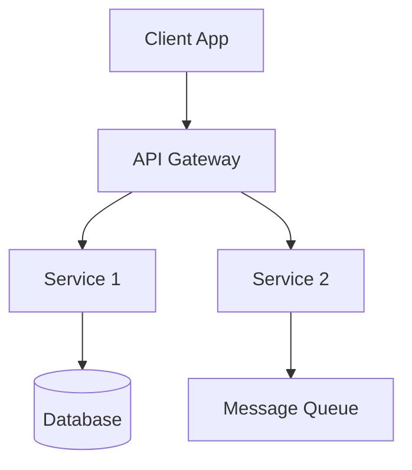

# System Architecture

<!-- This file will be populated by Copilot based on PLAN.md requirements -->

## Overview
_Describe the high-level system architecture here._

## Architecture Diagram

## Components
_List and describe each system component._

## Technology Stack
_List the recommended technologies for each component._
