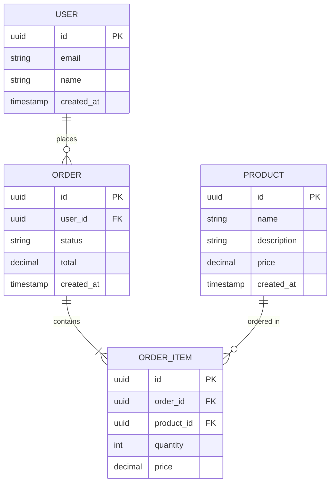

# Data Model

<!-- This file will be populated by Copilot based on PLAN.md requirements -->

## Entity Relationship Diagram

## Entities
_Describe each entity, its fields, and relationships._

## Indexes
_List recommended database indexes._

## Migrations
_Describe the migration strategy._
