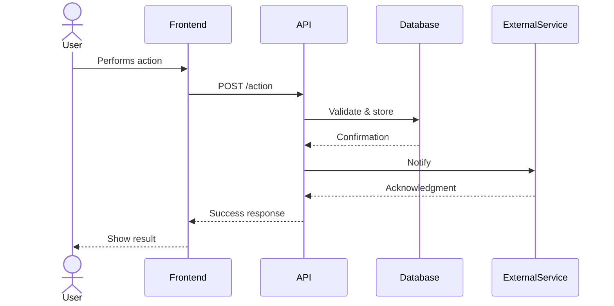
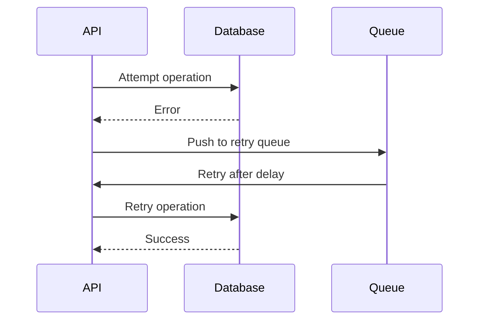

# Integration Flow

<!-- This file will be populated by Copilot based on PLAN.md requirements -->

## Overview
_Describe the key integration flows in the system._

## Main Flow

## Error Handling Flow

## Integration Points
_List all external system integrations._

## Authentication Flow
_Describe how services authenticate with each other._
